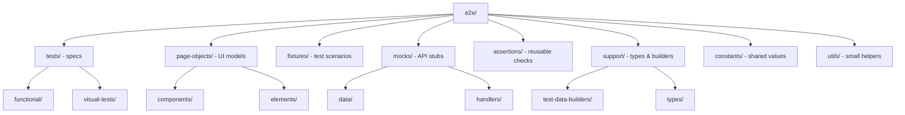

# FedEx Star Wars Search - E2E Tests

## 1. Goal

The `e2e/` folder contains Playwright-based end-to-end and visual tests for the Star Wars Search application.

- Stable, maintainable, requirement-focused tests
- Deterministic execution with mocked API responses
- Cross-browser support
- CI-ready execution with Docker

The primary focus is coverage of core requirements such as successful searches, empty results, and keyboard interaction. In addition, the suite includes visual tests for the most important UI components and pages in various states.

Some solutions were troubleshooted and implemented with AI assistance:

- Changes made to Angular codebase
- Docker setup
- `playwright.yml`
- README instructions

## 2. Test strategy

The test strategy focuses on the requirements listed in `ASSESSMENT.MD` and uses Playwright with TypeScript.

- Page objects, fixtures, and assertion helpers keep the suite maintainable, scalable, and CI-friendly.
- Tests can run locally by starting the web server as a precondition for execution.
- To avoid live network dependency, SWAPI calls are intercepted and tests use mocked data.

## 3. Folder structure

The `e2e/` folder is organised to keep tests readable, reusable, and easy to maintain.



- `tests/` — Playwright specs for functional and visual coverage
- `page-objects/` — page, component, and element abstractions for UI interactions
- `fixtures/` — reusable fixtures and prepared search scenarios
- `mocks/` — mocked API data, route handlers, and mock server utilities
- `assertions/` — domain-specific verification helpers for people and planets
- `support/` — shared types, builders, and supporting test utilities
- `constants/` — common labels and static values used across tests
- `utils/` — generic helper functions used by the suite

## 4. Coverage

- Functional tests validate character and planet search flows, including valid results, invalid results, multiple matches, search by button, search by `Enter`, and clearing results with empty input.
- Visual tests cover key UI components and page states such as initial view, loading state, empty-result state, and populated search results.

## 5. Running tests

### Local execution (without Docker)

1. Install dependencies:

   ```bash
   npm ci
   ```

2. Install Playwright browsers:

   ```bash
   npx playwright install
   ```

3. Run the full suite:

   ```bash
   npx playwright test
   ```

#### Run subsets locally

- Functional tests only:

  ```bash
  npx playwright test e2e/tests/functional
  ```

- Visual tests only:

  ```bash
  npx playwright test e2e/tests/visual-tests
  ```

#### npm scripts

- `npm run e2e:all` — run full test suite
- `npm run e2e:functional` — run functional tests
- `npm run e2e:visual` — run visual tests

#### Open report locally

```bash
npx playwright show-report
```

### Local execution (with Docker)

The Dockerfile layout assumes the build is run with the repo root as context, for example:

```bash
docker build -f e2e/Dockerfile .
```

That is why `.dockerignore` should be at the repo root, not under `e2e/`.

This setup allows you to:

- build the Playwright image from the repo root
- run the tests inside the container
- mount report folders to the host
- update Linux visual baselines locally when needed

Project setup already includes:

- `e2e/Dockerfile` that installs dependencies and runs `npx playwright test`
- `playwright.config.ts` with `webServer.command: npm run start`

You do not need to start the Angular web app manually. When the container starts, Playwright starts the Angular app inside the same container and runs the tests against it. The test runner accesses the app at `http://localhost:4200`.

**Prerequisite:** Docker Desktop installed and running

**Note:** All commands must be run from the repository root.

#### Docker commands

- Build the image:

  ```bash
  docker build -f e2e/Dockerfile -t fedex-playwright-e2e:local .
  ```

- Create folders for artifacts:

  ```bash
  mkdir -p playwright-report test-results
  ```

- Run the full suite in Docker:

  ```bash
  docker run --rm --ipc=host \
    -e CI=true \
    -v "$PWD/playwright-report:/app/playwright-report" \
    -v "$PWD/test-results:/app/test-results" \
    fedex-playwright-e2e:local
  ```

#### Run subsets in Docker

- Visual tests only:

  ```bash
  docker run --rm --ipc=host \
    -e CI=true \
    -v "$PWD/playwright-report:/app/playwright-report" \
    -v "$PWD/test-results:/app/test-results" \
    fedex-playwright-e2e:local npx playwright test e2e/tests/visual-tests
  ```

- Functional tests only:

  ```bash
  docker run --rm --ipc=host \
    -e CI=true \
    -v "$PWD/playwright-report:/app/playwright-report" \
    -v "$PWD/test-results:/app/test-results" \
    fedex-playwright-e2e:local npx playwright test e2e/tests/functional
  ```

### CI execution

CI execution is configured in `.github/workflows/playwright.yml`.

- The workflow is triggered manually via the GitHub Actions UI.
- The workflow builds the Docker image and runs the tests inside the container.
- A matrix strategy is used to run tests in parallel in multiple containers.
- Shard reports are merged into a single report artifact that can be downloaded for review.

### Visual tests baseline update for CI compatibility

Since the tests run in CI, native macOS or Windows snapshots cannot be used as the source of truth for CI visual test runs. The baseline for visual tests should therefore be updated locally using the same Linux-based environment and browser versions as CI (see `.github/workflows/playwright.yml` and `runs-on: ubuntu-latest`).

To preserve updated snapshots, mount the repository into the container so Linux snapshots are written back to your working tree, and run with `--update-snapshots`.

```bash
docker run --rm --ipc=host -e CI=true \
  -v "$PWD:/app" -w /app \
  fedex-playwright-e2e:local \
  /bin/bash -lc "npm ci && npx playwright test e2e/tests/visual-tests --update-snapshots"
```

## 6. Reporting and debugging

- After execution, the HTML report gives a summary of passed and failed tests.
- For failed tests, Playwright retains debugging artifacts such as traces and videos.
- In CI, shard reports are merged into a single report artifact to make result analysis easier.

## 7. Design decisions and trade-offs

The suite uses mocked API responses instead of live SWAPI calls to satisfy the requirement that tests must not depend on external resources.

- This improves stability and repeatability.
- It also means the suite does not execute real end-to-end calls to the external service.
- Without an additional layer of contract or component tests, regressions in the integration layer may go unnoticed.

Page objects, fixtures, and reusable assertion helpers were introduced to improve maintainability and scalability.

- This adds some structural complexity.
- It also makes the suite easier to extend.

Visual tests were included to increase UI confidence, with the trade-off of maintaining snapshot baselines.

## 8. Parallelisation

The suite is configured to run tests in parallel on multiple levels:

- Tests are executed in parallel inside a single Docker container (see `playwright.config.ts` and `fullyParallel: true`).
- CI runs tests in parallel across multiple containers (see `.github/workflows/playwright.yml` and the `strategy` section).

## 9. Changes introduced to Angular web app

As web app code modification was allowed, some changes were made to make the app more reliable for testing:

- Added `data-testid` attributes to make selectors more reliable
- Added sorting to search results to make result order deterministic
- Fixed list clearing on empty search input

Areas that can still be improved:

- Error handling in the app implementation (tests are prepared and currently marked with `fail`)

## 10. Future improvements

- Split tests into suites (for example: Smoke, Functional, Visual) and prepare separate GitHub workflows for each suite
- Improve CI and reporting, for example by using GitHub Container Registry or deploying the report to GitHub Pages
- Make fixtures worker-scoped if tests that change global state are added
- Extend the suite with accessibility-focused checks and broader negative-path scenarios
- Add JSDoc to more parts of the codebase where time constraints required skipping it
- Expose base URL as an environment variable
